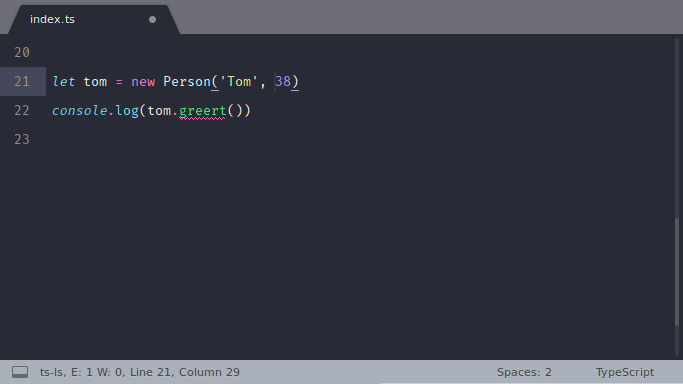

  <h1 align="center">LSP</h1>

  
  
  
  
  

Like an IDE, except it's the good parts. <a href="https://lsp.sublimetext.io">Learn more</a>.

</img>

## Installation

### Stable Version

Open the command palette and run `Package Control: Install Package`, then select `LSP`.

### Development Version

Clone this repository into your Packages directory. Open the command palette and run `Package Control: Satisfy Libraries`.

## Getting started

Follow the installation steps for a [specific language server](https://lsp.sublimetext.io/language_servers).

Open a document supported by the language server. LSP should report the language server starting in the status bar.

See more information in the [documentation](https://lsp.sublimetext.io) :open_book:.

## Getting help

If you have any problems, see the [troubleshooting](https://sublimelsp.github.io/LSP/troubleshooting/) guide for tips and known limitations. If the documentation cannot solve your problem, you can look for help in:

* The [#lsp](https://discordapp.com/channels/280102180189634562/645268178397560865) channel (join the [SublimeHQ Discord](https://discord.gg/TZ5WN8t) first!)
* By [searching or creating a new issue](https://github.com/sublimelsp/LSP/issues)
