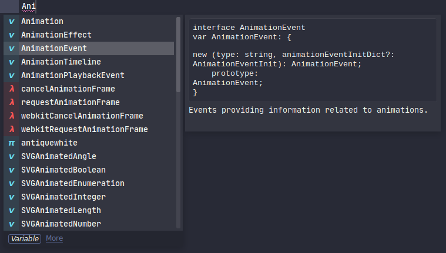

## Commands and shortcuts

### Plugin commands

* Restart Servers: kills all language servers belonging to the active window
    * This command only works when in a supported document.
    * It may change in the future to be always available, or only kill the relevant language server.
* LSP Settings: Opens package settings.

### Document actions

* Show Code Actions: `super+.`
* Symbol References: `shift+f12`
* Rename Symbol: UNBOUND
    * Recommendation: Override `F2` (next bookmark)
* Go to definition / type definition / declaration / implementation: UNBOUND
    * Recommendation: Override `f12` (built-in goto definition),
    * LSP falls back to ST3's built-in goto definition command in case LSP fails.
* Format Document: UNBOUND
* Format Selection: UNBOUND
* Document Symbols: UNBOUND

### Workspace actions

* Show Diagnostics Panel: `super+shift+M` / `ctr+alt+M`
* Next/Previous Diagnostic From panel: `F4` / `shift+F4`
* Workspace Symbol Search: via command Palette `LSP: workspace symbol`

### Execute server commands

For LSP servers that can handle [workspace/executeCommand](https://microsoft.github.io/language-server-protocol/specification#workspace_executeCommand), you can make these commands available into the sublime palette by adding an entry to your existing `.sublime-commands` file or by creating a new one.

Example:

```js
[
  // ...
  {
    "caption": "Thread First",
    "command": "lsp_execute",
    "args": { 
      "command_name": "thread-first",
      "command_args": ["${file_uri}", 0, 0]
    }
  }
]
```
Note: `command_args` is optional depending on the `workspace/executeCommand` that are supported by the LSP server.
The following variables will be expanded, but only if they are top-level array items and not within nested arrays or objects:

| Variable | Type | Description |
| -------- | ---- | ----------- |
| `"$file_uri"` or `"${file_uri}"` | string | File URI of the active view |
| `"$selection"` or `"${selection}"` | string | Content of the (topmost) selection |
| `"$offset"` or `"${offset}"` | int | Character offset of the (topmost) cursor position |
| `"$selection_begin"` or `"${selection_begin}"` | int | Character offset of the begin of the (topmost) selection |
| `"$selection_end"` or `"${selection_end}"` | int | Character offset of the end of the (topmost) selection |
| `"$position"` or `"${position}"` | object | Mapping `{ 'line': int, 'character': int }` of the (topmost) cursor position, see [Position](https://microsoft.github.io/language-server-protocol/specifications/specification-current/#position) |
| `"$range"` or `"${range}` | object | Mapping with `'start'` and `'end'` positions of the (topmost) selection, see [Range](https://microsoft.github.io/language-server-protocol/specifications/specification-current/#range) |

### Overriding keybindings

LSP's keybindings can be edited from the `Preferences: LSP Keybindings` command from the command palette.
There is a special context called `lsp.session_with_capability` that can check whether there is a language server active
with the given [LSP capability](https://microsoft.github.io/language-server-protocol/specifications/specification-current/#initialize).
Refer to the `ServerCapabilities` structure in that link.
The following example overrides `ctrl+r` to use LSP's symbol provider when we're in a javascript or typescript view:

```js
{
    "command": "lsp_document_symbols",
    "keys": [
        "ctrl+r"
    ],
    "context": [
        {
            "key": "lsp.session_with_capability",
            "operator": "equal",
            "operand": "documentSymbolProvider"
        },
        {
            "key": "selector",
            "operator": "equal",
            "operand": "source.ts, source.js"
        }
    ]
},
```

More useful keybindings (OS-X), edit Package Settings -> LSP -> Key Bindings
```js
  { "keys": ["f2"], "command": "lsp_symbol_rename" },
  { "keys": ["f12"], "command": "lsp_symbol_definition" },
  { "keys": ["super+option+r"], "command": "lsp_document_symbols" },
  { "keys": ["super+option+h"], "command": "lsp_hover"}
```

### Show autocomplete documentation

Some completion items can have documentation associated with them.



To show the documentation popup you can click the **More** link in the bottom of the autocomplete,
or you can use the default sublime keybinding <kbd>F12</kbd> to trigger it.

You can change the default keybinding by remapping the command as below:

```js
{
    "command": "auto_complete_open_link",
    "keys": ["f12"],
    "context": [
        {
            "key": "auto_complete_visible",
            "operator": "equal",
            "operand": true
        }
    ]
},
```
Note that <kbd>F12</kbd> may conflict with your Goto Definition keybinding. To avoid the conflict, make sure that you
have a context which checks that the AC widget is not visible:
```js
{
    "command": "lsp_symbol_definition",
    "keys": [
        "f12"
    ],
    "context": [
        {
            "key": "lsp.session_with_capability",
            "operator": "equal",
            "operand": "definitionProvider"
        },
        {
            "key": "auto_complete_visible",
            "operator": "equal",
            "operand": false
        }
    ]
},
```
There is an example of this in LSP's default keybindings.

### Mouse map configuration

See below link, but bind to `lsp_symbol_definition` command
https://stackoverflow.com/questions/16235706/sublime-3-set-key-map-for-function-goto-definition


## Configuring

### Sublime settings

Add these settings to LSP settings, your Sublime settings, Syntax-specific settings and/or in Project files.

* `lsp_format_on_save` `false` *run the server's formatProvider (if supported) on a document before saving.*
* `lsp_code_actions_on_save` `{}` *request code actions with specified identifiers to trigger before saving.*

### Package settings (LSP)

* `only_show_lsp_completions` `false` *disable sublime word completion and snippets from autocomplete lists*
* `code_action_on_save_timeout_ms` `2000` *the amount of time the code actions on save are allowed to run for*
* `show_references_in_quick_panel` `false` *show symbol references in Sublime's quick panel instead of the bottom panel*
* `show_view_status` `true` *show permanent language server status in the status bar*
* 'diagnostics_delay_ms' `0` *delay showing diagnostics by this many milliseconds*
* `diagnostics_additional_delay_auto_complete_ms` `0` *additional delay when the AC widget is visible*
* `auto_show_diagnostics_panel` `always` (`never`, `saved`) *open the diagnostics panel automatically if there are diagnostics*
* `show_diagnostics_count_in_view_status` `false` *show errors and warnings count in the status bar*
* `show_diagnostics_in_view_status` `true` *when on a diagnostic with the cursor, show the text in the status bar*
* `diagnostics_highlight_style` `"underline"` *highlight style of code diagnostics: "box", "underline", "stippled", "squiggly" or ""*
* `highlight_active_signature_parameter`: *highlight the active parameter of the currently active signature*
* `document_highlight_style`: *document highlight style: "box", "underline", "stippled", "squiggly" or ""*
* `document_highlight_scopes`: *customize your sublime text scopes for document highlighting*
* `diagnostics_gutter_marker` `"dot"` *gutter marker for code diagnostics: "dot", "circle", "bookmark", "sign" or ""*
* `show_symbol_action_links` `false` *show links to symbol actions like go to, references and rename in the hover popup*
* `disabled_capabilities`, `[]` *Turn off client capabilities (features): "hover", "completion", "documentHighlight", "colorProvider", "signatureHelp"
* `log_debug` `false` *show debug logging in the sublime console*
* `log_server` `[]` *log communication from and to language servers*
* `log_stderr` `false` *show language server stderr output in the console*
* `log_max_size` `8192` *max  number of characters of payloads to print*
