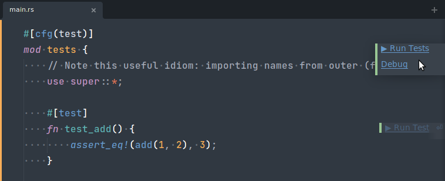
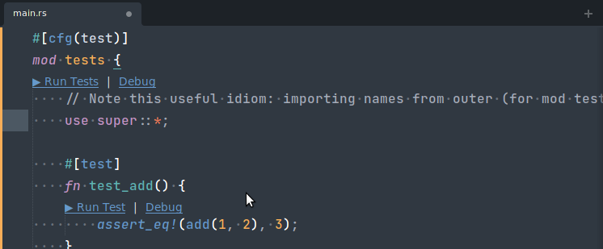
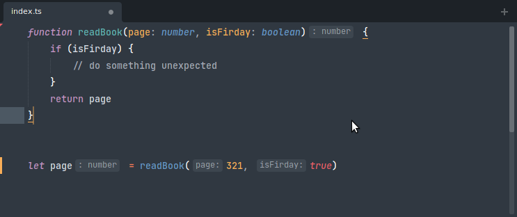

# Features

This package enhances existing concepts from Sublime Text and introduces new concepts not native to Sublime Text. This page provides an overview of the most important capabilities. The capabilities/concepts are accessible in different ways. Some are accessible via the Context Menu by right-clicking with your mouse, or via the top Menu Bar. Others are part of an existing workflow. Almost all capabilities can also be bound to a key with a key binding.

## Auto Complete

[Example GIF 1](https://user-images.githubusercontent.com/6579999/128551586-d2ca51f7-6d16-4e12-bec5-ad2e6bc6c1f1.gif)

[Example GIF 2](https://user-images.githubusercontent.com/5006548/119979746-06973480-bfc4-11eb-87c1-cc9caf72a6d7.gif)

The auto-complete functionality of Sublime Text is well-known to any user. It provides word completions from the current buffer, and, since ST4, completions from other files. It presents the auto-complete widget in a synchronous fashion.

The LSP package enhances the auto-complete list with results provided by the language server.

To show the documentation popup you can click the **More** link in the bottom of the autocomplete,
or you can use the default sublime keybinding <kbd>F12</kbd> to trigger it.

To insert or replace a completion item using the opposite "completion_insert_mode" setting value, the following keybinding can be used <kbd>alt+enter</kbd>.
Note, this feature can only be used if **Replace** or **Insert** are shown at the bottom of the autocomplete popup.

[Example GIF 3](https://user-images.githubusercontent.com/22029477/189607770-1a8018f6-1fd1-40de-b6d9-be1f657dfc0d.gif)

## Goto Definition

[Example GIF 1](https://user-images.githubusercontent.com/6579999/128551655-bfd55991-70a9-43da-a54a-f8d4cb3244c4.gif)

[Example GIF 2](https://user-images.githubusercontent.com/5006548/119979953-478f4900-bfc4-11eb-9274-9dda442dfa3f.gif)

Sublime Text provides a "Goto Definition" feature by indexing the files in your project, and building a database out of the parsed files. The feature is accessible by clicking on Goto > Goto Definition. Sublime will attempt to jump to the definition of the word enclosing the caret. The files are parsed according to the `.sublime-syntax` associated to them. Entities which are assigned the `entity.name.*` scope are considered to be a "definition". Because a single `.sublime-syntax` file has no knowledge of the project structure, there may be multiple such "definitions".

This package provides a replacement for Sublime's Goto Definition if your language server has this capability. The feature is accessible by right-clicking with your mouse on the word (or any character) and clicking on LSP > Goto Definition. Similarly, an entry in the Goto menu in the top Menu Bar is also available.

In addition to the basic "Goto Definition", the protocol also provides further refinements of "goto" functionality:

- Goto Type Definition
- Goto Declaration
- Goto Implementation

Additionally, the LSP's "Goto Definition" command can fall back to the built-in Sublime's "Goto Definition" if the `fallback` argument is set to `true`.
This way, when there are no results found the built-in "Goto Definition" command will be triggered.

To attempt to open the results in a certain group, you can use the `group` argument. If the specified `group` does not exist, then it will be ignored.

## Find References

[Example GIF 1](https://user-images.githubusercontent.com/6579999/128551752-b37fe407-148c-41cf-b1e4-6fe96ed0f77c.gif)

[Example GIF 2](https://user-images.githubusercontent.com/5006548/119979971-5118b100-bfc4-11eb-9b6a-c0e109b1843c.gif)

By parsing and indexing a project with `.sublime-syntax` files, Sublime Text is able to provide an approximation of where a type or function is used.

This package provides a replacement of that functionality if your language server has this capability.

Additionally, the LSP's "Find References" command can fall back to the built-in Sublime's "Goto Reference" if the `fallback` argument is set to `true`.
This way, when there are no results found the built-in "Goto Reference" command will be triggered.

## Highlights

[Example GIF 1](https://user-images.githubusercontent.com/6579999/128552021-d9058c65-d6f6-48f5-b7aa-652eafe23247.gif)

Sublime Text subtly highlights words that equal the one under your caret.

This package does that as well, if your language server has that capability. It is enhanced in the sense that a language server can also annotate a region as being _written to_, to being _read from_. This is what stock Sublime Text cannot determine.

## Goto Symbol

[Example GIF 1](https://user-images.githubusercontent.com/2431823/128565305-a38cdcba-d05a-42f9-ae5f-1e1236661f68.gif)

[Example GIF 2](https://user-images.githubusercontent.com/2431823/128565554-69146e9f-d601-493a-b9f4-bc9f8ca6aa50.gif)

Goto Symbol can be accessed by clicking on Goto > Goto Symbol. A common key binding for this is <kbd>ctrl</kbd><kbd>R</kbd>. Sublime Text will show a Quick Panel where you can select a symbol from the current buffer. This package provides a replacement if your language server has this capability. Each symbol's type is accurately described, and the start and end positions of each symbol are clearly visible.

## Goto Symbol In Project

[Example GIF 1](https://camo.githubusercontent.com/e7a6dd90838b0a8dab8c08d7846c86bfe0e271e7f213e362ba1b07df2d90c156/68747470733a2f2f692e696d6775722e636f6d2f385830584e69322e676966)

Goto Symbol In Project is a great feature of Sublime Text. It is like Goto Symbol, except you can search for a symbol through your entire project. It is a two-step UX process where you first select an identifier, and you are then presented with the possible locations of your selected identifier. This package provides a replacement if your language server has this capability. The "LSP" Goto Symbol In Project works slightly different because it is a one-step process instead of a two-step process. You select the appropriate symbol immediately.

## Expand Selection

[Example GIF 1](https://user-images.githubusercontent.com/6579999/128551797-3ce23a0b-f2d6-4b27-a47a-25b8ef3bc93b.gif)

Expand Selection can be accessed by clicking on Selection > Expand Selection. A common key binding for this is <kbd>ctrl</kbd><kbd>shift</kbd><kbd>A</kbd>. A language server may also have this capability and is in a better position to decide what a "smart" Expand Selection should do.

## Hover

[Example GIF 1](https://user-images.githubusercontent.com/2431823/128563600-f0add13f-74e6-4d25-8853-bcf9cf2b1f2e.gif)

"Hover" is a general term for an informational popup that appears when you bring your mouse to a word in the file. Sublime Text shows the definition(s) and references of the word that is under your caret.

The LSP package replaces this built-in hover popup with your language server's hover info, if it has the capability. For instance, it may display type information, documentation, and example usage.

## Diagnostics

[Example GIF 1](https://user-images.githubusercontent.com/2431823/128563600-f0add13f-74e6-4d25-8853-bcf9cf2b1f2e.gif)

Diagnostics is a general term for "things that are of interest in the file". It may be syntax errors, warnings from your compiler, or hints about unused variables in a function.

It is incorrect to call this "lint results", because diagnostics encompass more than just lint results.

It is also incorrect to call these "problems", as hints are not really problems.

Sublime Text has no concept of diagnostics (nor lint results or problems), and hence does not provide an API endpoint to push diagnostics to the end-user. This package invented its own diagnostics presentation system.

The SublimeLinter package provides similar functionality.

## Formatting

[Example GIF 1](https://user-images.githubusercontent.com/5006548/119979865-26c6f380-bfc4-11eb-9273-93b848cc8e87.gif)

Formatting is the art of computing a minimal set of white space text replacements. Formatting may be applied manually through a command invocation, or automatically when saving the file. Sublime Text has no concept of Formatting.

## Signature Help

[Example GIF 1](https://user-images.githubusercontent.com/5006548/119979818-1c0c5e80-bfc4-11eb-9056-3cc0cae2e38b.gif)

Signature Help is similar to Auto Complete, but focuses on presenting the different overloads of a function invocation. This package provides Signature Help by means of showing a popup. If multiple overloads exist, you can browse through them just like Auto Complete. Sublime Text has no concept of Signature Help.

## Rename

[Example GIF 1](https://user-images.githubusercontent.com/5006548/119980137-891ff400-bfc4-11eb-830e-509a5dd181bb.gif)

When you want to rename an identifier in Sublime Text, you probably use <kbd>ctrl</kbd><kbd>D</kbd> to select a few next occurences and do the rename with multiple cursors.

Because a language server (usually) has an abstract syntax tree view of the file, it may be able to rename an identifier semantically. This package exposes that functionality through the hover popup, the context menu, and the top menu bar.

Some language servers provide _global_ rename functionality as well. This package will present a modal dialog to ask you to confirm to apply the changes if they span more than one file.

## Code Actions

[Example GIF 1](https://user-images.githubusercontent.com/6579999/128551838-293d8cae-55b6-41e8-aea6-eb6b2b81e4ff.gif)

[Example GIF 2](https://user-images.githubusercontent.com/5006548/119979896-321a1f00-bfc4-11eb-96f4-47fb1db48728.gif)

Code Actions are an umbrella term for "Quick Fixes" and "Refactorings". They are actions that change the file (or more than one file) to resolve a diagnostic or apply a standard refactor technique. For instance, extracting a block of code into a separate method is usually called "Extract Method" and is a "Refactoring". Whereas "add a missing semicolon" would resolve a diagnostic that warns about a missing semicolon.

Formatting is different from Code Actions because Formatting is supposed to _not_ mutate the abstract syntax tree of the file, only move around white space. Any Code Action will mutate the abstract syntax tree.

This package presents "Quick Fix" Code Actions as a bluish clickable annotation positioned to the right of the viewport. Alternatively, they can be presented as a light bulb in the Gutter Area.

Sublime Text has no concept of Code Actions.

## Code Lenses

Code Lenses are "actionable contextual information interspersed" in your source code.

- Actionable: You can click on the link and something happens.
- Contextual: The links are close to the code they are representing.
- Interspersed: The links are located throughout your source code.

This package presents Code Lenses as a greenish clickable annotation positioned to the right of the viewport. Alternatively, they can be presented as phantoms.

Sublime Text has no concept of Code Lenses.

=== ""show_code_lens": "annotation""

    

=== ""show_code_lens": "phantom""

    

## Inlay Hints

Inlay hints are short textual annotations that show parameter names and type hints for servers that support that feature.

Inlay hints are disabled by default and can be enabled with the `"show_inlay_hints": true` setting through `Preferences: LSP Settings`.

!!! info "Some servers require additional settings to be enabled in order to show inlay hints."

## Server Commands

In Sublime Text you can bind any runnable command to a key or add it to various UI elements. Commands in Sublime Text are normally supplied by plugins or packages written in Python. A language server may provide a runnable command as well. These kinds of commands are wrapped in an `lsp_execute` Sublime command that you can bind to a key, see [Execute server commands](commands.md#execute-server-commands) for details.
