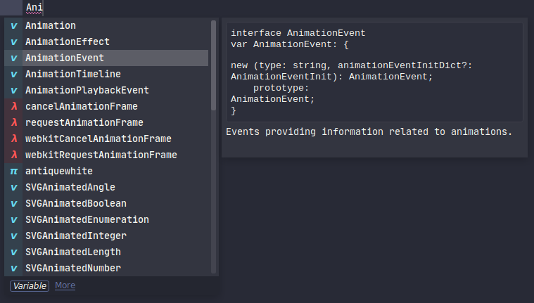

## Commands and shortcuts

### Plugin commands

* Restart Servers: kills all language servers belonging to the active window
    * This command only works when in a supported document.
    * It may change in the future to be always available, or only kill the relevant language server.
* LSP Settings: Opens package settings.

### Document actions

* Show Code Actions: UNBOUND
* Symbol References: `shift+f12`
* Rename Symbol: UNBOUND
    * Recommendation: Override `F2` (next bookmark)
* Go to definition / type definition / declaration / implementation: UNBOUND
    * Recommendation: Override `f12` (built-in goto definition),
    * LSP falls back to ST3's built-in goto definition command in case LSP fails.
* Format Document: UNBOUND
* Format Selection: UNBOUND
* Document Symbols: UNBOUND

### Workspace actions

* Show Diagnostics Panel: `super+shift+M` / `ctr+alt+M`
* Next/Previous Diagnostic From panel: `F4` / `shift+F4`
* Workspace Symbol Search: via command Palette `LSP: workspace symbol`

### Execute server commands

For LSP servers that can handle [workspace/executeCommand](https://microsoft.github.io/language-server-protocol/specification#workspace_executeCommand), you can make these commands available in Sublime's Command Palette by adding an entry to your existing `*.sublime-commands` file or by creating a new one.

Example:

```js
[
  // ...
  {
    "caption": "Thread First",
    "command": "lsp_execute",
    "args": {
      "session_name": "LSP-pyright",
      "command_name": "thread-first",
      "command_args": ["${file_uri}", 0, 0]
    }
  }
]
```

Notes:

 - the `session_name` is required and needs to match the server's key within the `clients` configuration object.
 - the `command_args` is optional depending on the `workspace/executeCommand` that are supported by the LSP server.

You can include special variables in the `command_args` array that will be automatically expanded. Supported variables include Sublime's built-in ones (see the full list in the [Build Systems](http://www.sublimetext.com/docs/build_systems.html#variables) documentation) as well as additional variables listed below. Note that the built-in variables will be expanded regardless of where they are in the array and also within nested arrays or objects while the variables listed below will only be expanded in the top-level array values and only if those values match exactly (will not match if they are sub-strings of values):

| Variable | Type | Description |
| -------- | ---- | ----------- |
| `"$document_id"` or `"${document_id}"` | object | JSON object `{ 'uri': string }` containing the file URI of the active view, see [Document Identifier](https://microsoft.github.io/language-server-protocol/specifications/specification-current/#textDocumentIdentifier) |
| `"$file_uri"` or `"${file_uri}"` | string | File URI of the active view |
| `"$selection"` or `"${selection}"` | string | Content of the (topmost) selection |
| `"$offset"` or `"${offset}"` | int | Character offset of the (topmost) cursor position |
| `"$selection_begin"` or `"${selection_begin}"` | int | Character offset of the begin of the (topmost) selection |
| `"$selection_end"` or `"${selection_end}"` | int | Character offset of the end of the (topmost) selection |
| `"$position"` or `"${position}"` | object | JSON object `{ 'line': int, 'character': int }` of the (topmost) cursor position, see [Position](https://microsoft.github.io/language-server-protocol/specifications/specification-current/#position) |
| `"$range"` or `"${range}"` | object | JSON object with `'start'` and `'end'` positions of the (topmost) selection, see [Range](https://microsoft.github.io/language-server-protocol/specifications/specification-current/#range) |

### Overriding keybindings

LSP's keybindings can be edited from the `Preferences: LSP Keybindings` command from the command palette.
There is a special context called `lsp.session_with_capability` that can check whether there is a language server active
with the given [LSP capability](https://microsoft.github.io/language-server-protocol/specifications/specification-current/#initialize).
Refer to the `ServerCapabilities` structure in that link.
The following example overrides `ctrl+r` to use LSP's symbol provider when we're in a javascript or typescript view:

```js
{
    "command": "lsp_document_symbols",
    "keys": [
        "ctrl+r"
    ],
    "context": [
        {
            "key": "lsp.session_with_capability",
            "operator": "equal",
            "operand": "documentSymbolProvider"
        },
        {
            "key": "selector",
            "operator": "equal",
            "operand": "source.ts, source.js"
        }
    ]
},
```

More useful keybindings (OS-X), edit Package Settings -> LSP -> Key Bindings
```js
  { "keys": ["f2"], "command": "lsp_symbol_rename" },
  { "keys": ["f12"], "command": "lsp_symbol_definition" },
  { "keys": ["super+option+r"], "command": "lsp_document_symbols" },
  { "keys": ["super+option+h"], "command": "lsp_hover"}
```

### Show autocomplete documentation

Some completion items can have documentation associated with them.



To show the documentation popup you can click the **More** link in the bottom of the autocomplete,
or you can use the default sublime keybinding <kbd>F12</kbd> to trigger it.

You can change the default keybinding by remapping the command as below:

```js
{
    "command": "auto_complete_open_link",
    "keys": ["f12"],
    "context": [
        {
            "key": "auto_complete_visible",
            "operator": "equal",
            "operand": true
        }
    ]
},
```
Note that <kbd>F12</kbd> may conflict with your Goto Definition keybinding. To avoid the conflict, make sure that you
have a context which checks that the AC widget is not visible:
```js
{
    "command": "lsp_symbol_definition",
    "keys": [
        "f12"
    ],
    "context": [
        {
            "key": "lsp.session_with_capability",
            "operator": "equal",
            "operand": "definitionProvider"
        },
        {
            "key": "auto_complete_visible",
            "operator": "equal",
            "operand": false
        }
    ]
},
```
There is an example of this in LSP's default keybindings.

### Mouse map configuration

See below link, but bind to `lsp_symbol_definition` command
https://stackoverflow.com/questions/16235706/sublime-3-set-key-map-for-function-goto-definition
