# Features

LSP enhances existing concepts from Sublime Text and introduces new concepts not native to Sublime Text.
This page provides an overview about the most important capabilities.
The capabilities/concepts are accessible in different ways.
Some are accessible as a command from the command palette, via the right-click context menu, or from the main menu of the window.
Others are part of an existing workflow.
Almost all capabilities can also be bound to a key with a key binding.

!!! note
    Not every server supports all of these capabilities, and some of them need to be enabled with a user setting or a configuration option of the language server.


## Auto Complete

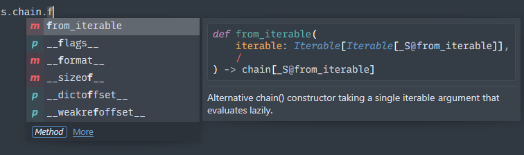

The LSP package enhances the auto-complete functionality of Sublime Text with results provided by the language server.
If available, you can click the **More** link or use the default key binding <kbd>F12</kbd> to show an additional documentation popup with detailed information about the highlighted item.

Some language servers provide two different modes for inserting a completion item when the caret is in the middle of a word, in which case **Replace** or **Insert** is shown at the bottom of the auto-completion popup.
The default insertion mode can be configured with the `"completion_insert_mode"` setting, and the opposite mode can be used by confirming a completion item with the key binding <kbd>Alt</kbd><kbd>Enter</kbd>.

[Example GIF for "Replace" mode](https://user-images.githubusercontent.com/22029477/189607770-1a8018f6-1fd1-40de-b6d9-be1f657dfc0d.gif)


## Signature Help

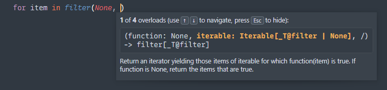

The signature help popup appears when typing the arguments of a function call.
It highlights the name of the current parameter and often presents additional type information and documentation of the function and parameters.
If multiple overloads of the function exist, you can switch between them using the up and down arrow keys.

The styles in the signature help popup can be adjusted by defining color scheme rules for the following scopes:

| scope | description |
| ----- | ----------- |
| `meta.signature-help` | Full signature line |
| `meta.signature-help.parameter` | Function parameters |
| `variable.parameter.sighelp.active` | Function parameter which is currently highlighted |

!!! note
    If there is no special rule for the `variable.parameter.sighelp.active` scope in the color scheme, the highlighted parameter is rendered with bold font style by default.
    Note that the color scheme rules are cached and therefore modifications don't take effect immediately.
    Switch to a different color scheme and back, to apply the style changes.


## Hover

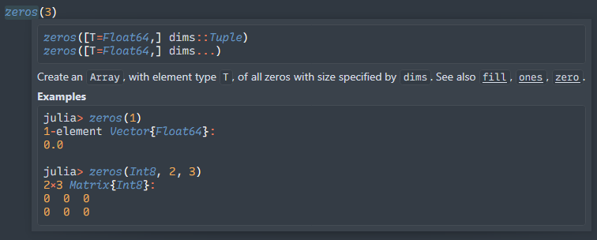

Sublime Text shows a built-in popup with the definitions and references when you hover with the mouse over an identifier name in the file.
LSP replaces this popup with information from the language server, often displaying type information, documentation, and example usage.

LSP internally uses the [mdpopups](https://github.com/facelessuser/sublime-markdown-popups) library to render the popups.
You can override its style by creating a `Packages/User/mdpopups.css` file.
For example, to get the same font in the popup as in the editor, use

```css title="Packages/User/mdpopups.css"
html {
    --mdpopups-font-mono: "your desired font face";
}
```

See the [mdpopups documentation](http://facelessuser.github.io/sublime-markdown-popups/) for more details.

LSP can also highlight the word or range for which a hover popup is shown, if the `"hover_highlight_style"` setting is enabled.
In that case you can use the scope `markup.highlight.hover` in a color scheme rule to control the highlighting color.
If the setting is set to `"background"`, the highlighting color can be controlled using the "background" property in the color scheme rule.


## Highlights

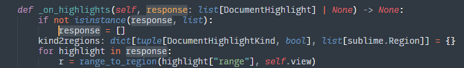

When you select a word, Sublime Text highlights other occurrences of that word in the file (controlled by the `"match_selection"` setting).
LSP has a similar capability to highlight the identifier name that is currently under the caret.
It is enhanced in the sense that the highlighted locations are restricted to only the relevant part of the file, according to the scoping rules of the language.
Furthermore it can distinguish between read and write access of a variable and may highlight them with different colors.

The highlighting color can be adjusted with color scheme rules for the following scopes:

| [Document Highlight Kind](https://microsoft.github.io/language-server-protocol/specifications/specification-current/#documentHighlightKind) | scope | description |
| --- | --- | --- |
| Text | `markup.highlight.text` | A textual occurrence |
| Read | `markup.highlight.read` | Read-access of a symbol |
| Write | `markup.highlight.write` | Write-access of a symbol |

If `"document_highlight_style"` is set to `"background"` in the LSP settings, the highlighting color can be controlled using the "background" property in the color scheme rule.


## Semantic Highlighting

=== "enabled"

    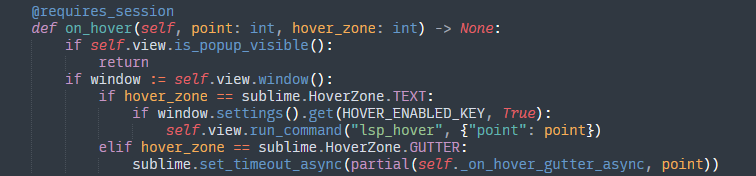

=== "disabled"

    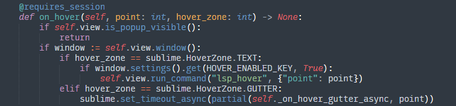

Semantic highlighting enhances regular syntax highlighting by using additional information about the source code that are not accessible for the RegEx-based syntax definitions.
For example, it can highlight argument names in the function body with the same color used in the function signature, or assign different colors to references of regular variables and of variables that were declared as constant.

In order to support semantic highlighting, the color scheme requires a special rule with a background color set for semantic tokens, which is (marginally) different from the original background.
LSP automatically adds such a rule to the built-in color schemes from Sublime Text.
If you use a custom color scheme, select *UI: Customize Color Scheme* from the Command Palette and add the following rule:

```jsonc
{
    "rules": [
        {
            "scope": "meta.semantic-token",
            "background": "#00000101" // must be (marginally) different from the original color scheme background
        },
    ]
}
```

!!! note
    Semantic highlighting is disabled by default.
    To enable it, set `"semantic_highlighting": true` in the LSP settings.

!!! warning
    There are several known limitations when semantic highlighting is used.
    For instance, there are visible artifacts on lines with semantic highlighting if the `"highlight_line"` setting is enabled, and italic and bold font styles don't work for regions with semantic highlighting.

It is possible to adjust the colors for semantic tokens by applying a foreground color to the individual token types:

| [Semantic Token Type](https://microsoft.github.io/language-server-protocol/specifications/specification-current/#semanticTokenTypes) | scope | fallback scopes |
| --- | --- | --- |
| namespace | `meta.semantic-token.namespace` | `variable.other.namespace`<br>`entity.name.namespace` |
| type | `meta.semantic-token.type` | `storage.type`<br>`entity.name.type`<br>`support.type` |
| class | `meta.semantic-token.class` | `storage.type.class`<br>`entity.name.class`<br>`support.class` |
| enum | `meta.semantic-token.enum` | `variable.other.enum`<br>`entity.name.enum` |
| interface | `meta.semantic-token.interface` | `entity.other.inherited-class`<br>`entity.name.interface` |
| struct | `meta.semantic-token.struct` | `storage.type.struct`<br>`entity.name.struct`<br>`support.struct` |
| typeParameter | `meta.semantic-token.typeparameter` | `variable.parameter.generic` |
| parameter | `meta.semantic-token.parameter` | `variable.parameter` |
| variable | `meta.semantic-token.variable` | `variable.other`<br>`variable.other.constant` |
| property | `meta.semantic-token.property` | `variable.other.property` |
| enumMember | `meta.semantic-token.enummember` | `constant.other.enum` |
| event | `meta.semantic-token.event` | `entity.name.function` |
| function | `meta.semantic-token.function` | `variable.function`<br>`entity.name.function`<br>`support.function.builtin` |
| method | `meta.semantic-token.method` | `variable.function`<br>`entity.name.function`<br>`support.function.builtin` |
| macro | `meta.semantic-token.macro` | `variable.macro`<br>`entity.name.macro`<br>`support.macro` |
| keyword | `meta.semantic-token.keyword` | `keyword` |
| modifier | `meta.semantic-token.modifier` | `storage.modifier` |
| comment | `meta.semantic-token.comment` | `comment`<br>`comment.block.documentation` |
| string | `meta.semantic-token.string` | `string` |
| number | `meta.semantic-token.number` | `constant.numeric` |
| regexp | `meta.semantic-token.regexp` | `string.regexp` |
| operator | `meta.semantic-token.operator` | `keyword.operator` |
| decorator | `meta.semantic-token.decorator` | `variable.annotation` |
| label | `meta.semantic-token.label` | `entity.name.label` |

If you define color scheme rules for the `meta.semantic-token.*` scopes listed above, they take precedence over the fallback scopes used by LSP to determine the default semantic highlighting colors.
The fallback scopes can depend on additional [token modifiers](https://microsoft.github.io/language-server-protocol/specifications/specification-current/#semanticTokenModifiers).

Language servers can also add their custom token types and modifiers, which are not defined in the protocol.
The default scopes for such custom tokens are defined in a `"semantic_tokens"` mapping in the server configuration, for example in the settings file of an LSP-\* helper package.
The keys of this mapping should be the token types and the values are the corresponding scopes.
Semantic tokens with exactly one token modifier can be targeted by appending the modifier after a dot.

```jsonc
{
    "semantic_tokens": {
        "magicFunction": "support.function.builtin",
        "selfParameter": "variable.language",
        "type.defaultLibrary": "storage.type.builtin",
    }
}
```

The color for custom token types can also be controlled from a color scheme rule for the scope `meta.semantic-token.<token-type>`, where `<token-type>` is the name of the custom token type, but with all letters lowercased, similar to the scopes that are listed in the table above.
To target tokens with one modifier, use the scope `meta.semantic-token.<token-type>.<token-modifier>` (all lowercase).
It is currently not possible to target semantic tokens with more than one modifier.

If neither a scope for a custom token type is defined, nor a color scheme rule for this token type exists, then it is only highlighted via regular syntax highlighting.

!!! note
    The presence of rules for custom token types is cached and therefore color scheme modifications don't take effect immediately.
    Semantic highlighting for custom token types should work after switching the active color scheme and then editing the document.


## Goto Definition

LSP provides a "Goto Definition" command, which can be more accurate than the syntax-based "Goto Definition" functionality from Sublime Text, due to the language server's additional knowledge about the project structure and type information.
It is accessible from the right-click context menu, under *Goto* from the main menu, or can be bound to a user-defined key binding.

The command from LSP can also fall back to Sublime's built-in "Goto Definition" if the `"fallback"` argument is set to `true`.
This way, the built-in "Goto Definition" command will be triggered when there are no results found.

If applicable to the language and supported by the server, further refinements may be available in addition to the basic "Goto Definition" functionality:

- Goto Type Definition
- Goto Declaration
- Goto Implementation


## Find References

LSP has a "Find References" command that is similar to the built-in "Goto Reference…", but can provide more accurate results.
The command from LSP replaces the default key binding <kbd>Shift</kbd><kbd>F12</kbd>, and it can also be accessed from the right-click context menu, from the main menu, and from the command palette.
If the `fallback` command argument is set to `true` in a user-defined key binding or command palette entry, LSP's "Find References" can fall back to the built-in "Goto Reference…" when there are no results found by the language server.


## Diagnostics

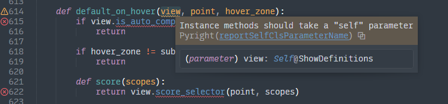

LSP highlights syntax and type errors, linter warnings and other information like hints about unused variables in the source code.
Additionally, an icon is shown in the gutter for lines that contain diagnostics with severity *information* or higher.

Diagnostics can also be presented as annotations positioned to the right of the viewport, if the `"show_diagnostics_annotations_severity_level"` setting is enabled:

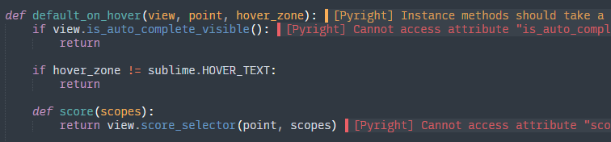

The colors for diagnostics can be adjusted with color scheme rules for the following scopes:

| [Diagnostic Severity](https://microsoft.github.io/language-server-protocol/specifications/specification-current/#diagnosticSeverity) | scope | drawn as |
| --- | --- | --- |
| Error | `markup.error` | squiggly underline |
| Warning | `markup.warning` | squiggly underline |
| Information | `markup.info` | stippled underline |
| Hint | `markup.info.hint` | stippled underline |

Diagnostics also optionally include the following scopes:

| [Diagnostic Tag](https://microsoft.github.io/language-server-protocol/specifications/specification-current/#diagnosticTag) | scope | description |
| --- | --- | --- |
| Unnecessary | `markup.unnecessary` | Unused or unnecessary code |
| Deprecated | `markup.deprecated` | Deprecated or obsolete code |

Those scopes can be used to, for example, gray out the text color of unused code, if the server supports that.

For example, to add a custom rule for the Mariana color scheme, select *UI: Customize Color Scheme* from the Command Palette and add the following rule:

```jsonc
{
    "rules": [
        {
            "scope": "markup.unnecessary",
            "foreground": "rgba(255, 255, 255, 0.4)",
            "background": "#00000101" // must be (marginally) different from the original color scheme background
        },
    ]
}
```


## Code Actions

Code actions is an umbrella term for "Quick Fixes" and "Refactorings".
These are actions that can resolve a diagnostic, or to apply a standard refactoring technique, like extracting a block of code into a separate method.
LSP presents "Quick Fix" code actions as a clickable annotation positioned to the right of the viewport.
Alternatively they can be shown as a lightbulb icon in the gutter.
"Refactor" code actions are accessible from the right-click context menu and under *Edit* from the main menu.

The accent color for code action annotations can be controlled with a color scheme rule for the `markup.accent.codeaction` scope (blue by default).

Certain code actions can also be run automatically on file save (`"lsp_code_actions_on_save"` setting) or when file formatting is triggered (`"lsp_code_actions_on_format"` setting).
This includes actions which sort the import lines in the file, or to automatically apply all available fixes for diagnostics.


## Code Lenses

Code Lenses are actionable contextual information that are interspersed in the source code.
Typical examples are the reference counts to functions and type definitions, or testrunner integrations for unit tests.

LSP presents code lenses as a clickable annotation positioned to the right of the viewport.
Alternatively they can be presented as phantoms beneath the lines.

=== ""show_code_lens": "phantom""

    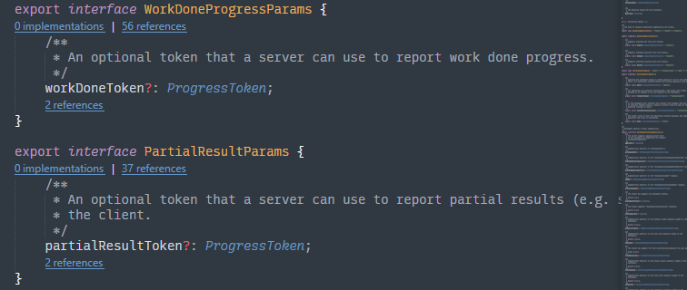

=== ""show_code_lens": "annotation""

    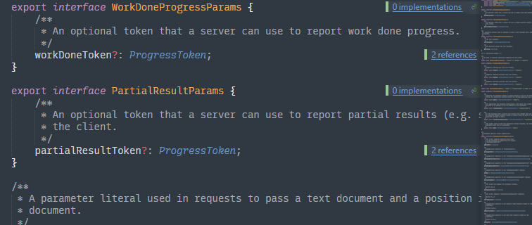

The accent color for code lens annotations can be controlled with a color scheme rule for the `markup.accent.codelens` scope (green by default).


## Inlay Hints

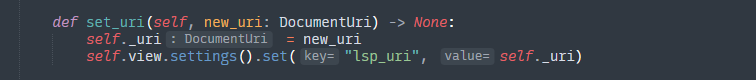

Inlay hints are short textual annotations that show parameter names and type hints.

!!! note
    Inlay hints are disabled by default. To enable them, set `"show_inlay_hints": true` in the LSP settings.
    Some servers require additional settings to be enabled in their server configuration.

The styles for inlay hints are defined in the [`inlay_hints.css`](https://github.com/sublimelsp/LSP/blob/main/inlay_hints.css) file in the root directory of the LSP package.
To adjust the style, you can create an [override](https://www.sublimetext.com/docs/packages.html#overriding-files-from-a-zipped-package) for this file (a restart of Sublime Text is required to apply the changes).


## Goto Symbol

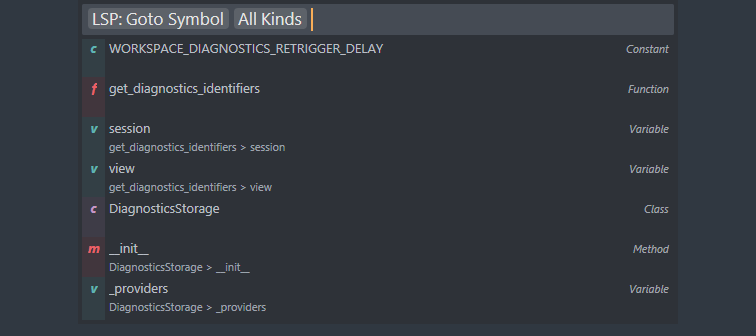

LSP provides a replacement for the built-in "Goto Symbol" command, which displays all symbols from the active file in the command palette and allows to quickly jump to their locations.
The command from LSP can provide more detailed descriptions and also allows to filter symbols according to their kind by pressing <kbd>backspace</kbd> in the input field.
Please note that LSP does *not* replace the default key binding <kbd>Ctrl</kbd><kbd>R</kbd> for the built-in command.


## Goto Symbol in Project

The "Goto Symbol in Project" command from LSP is similar, but can access the symbols from all files in the project.
The results are updated dynamically while typing in the input field.


## Goto Diagnostic

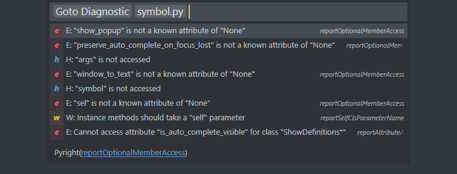

The "Goto Diagnostic" command provides an overview over all diagnostic in a file, and makes it easy to navigate to their locations.
You can press <kbd>backspace</kbd> in the input field to switch between files with diagnostics.


## Formatting

Formatting can be triggered from the command palette, and it can be configured to run automatically on save or on paste.
Many language servers either provide detailed formatting options in the server configuration, or apply formatting rules from a configuration file from the project folder.


## Call Hierarchy

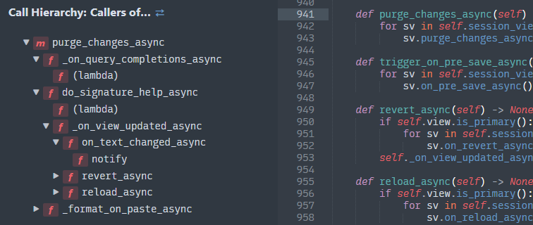

Call hierarchy presents a tree-based view of all callers of a function and their respective callers.
LSP shows the call hierarchy in a side-by-side view, which opens the location when you click on an item in the tree.
This makes it easy to navigate through each code path up the call chain and can be a useful tool for refactoring operations.
Call hierarchy can also be toggled to show a structured view of all outgoing calls instead.
The "Show Call Hierarchy" command is available from the right-click context menu and from the command palette.


## Type Hierarchy

Type hierarchy is similar to call hierarchy, just for super and subtypes, or parent and child classes.


## Rename Symbol

When you want to rename an identifier in Sublime Text, you probably use <kbd>Ctrl</kbd><kbd>D</kbd> to select a few next occurences and do the rename with multiple cursors.

Because a language server (usually) has an abstract syntax tree view of the file, it may be able to rename an identifier semantically.
This package exposes that functionality through the hover popup, the context menu, and the top menu bar.

Some language servers provide _global_ rename functionality as well.
This package will present a modal dialog to ask you to confirm to apply or preview the changes if they span more than one file.


## Rename File

Some language servers support updating imports when renaming a file.

<video src="/videos/file-rename.mp4" controls></video>


## Expand Selection

Sublime Text has the built-in functionality to expand the current selection, with the default key binding <kbd>Ctrl</kbd><kbd>Shift</kbd><kbd>A</kbd>.
A language server may also have this capability and is in a better position to decide what a "smart" Expand Selection should do.


## Server Commands

Language servers can have custom commands to provide additional functionalities.
Such server commands can be executed manually via the `lsp_execute` command from LSP, that you can bind to a key.
See [Execute server commands](commands.md#execute-server-commands) for details.
